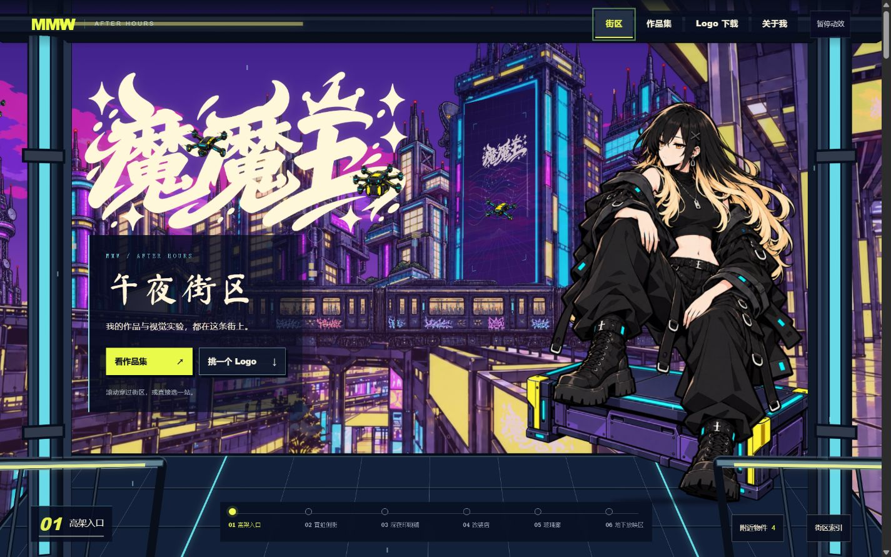

# 魔魔王 · 午夜街区

## [↗ 进入网站 / EXPLORE THE CITY](https://momowangouo.github.io/momowang-city/)

**赛博朋克城市探索 · 日系赛璐璐 · Logo 实物呈现**

[沿街探索](https://momowangouo.github.io/momowang-city/#street) · [玻璃廊](https://momowangouo.github.io/momowang-city/#glass) · [幕后档案](https://momowangouo.github.io/momowang-city/#archive)

六个连续街区，28 组、161 项呈现。滚动穿过城市，查看店牌、印刷品、金属、织物和玻璃上的 Logo；近景支持最佳呈现、同底对照和下载。

本仓库只保存公开静态网站及已获授权的素材，由 GitHub Pages 发布。开发源码和制作源图保存在私人仓库；签名母版审批状态独立于网站展示。
