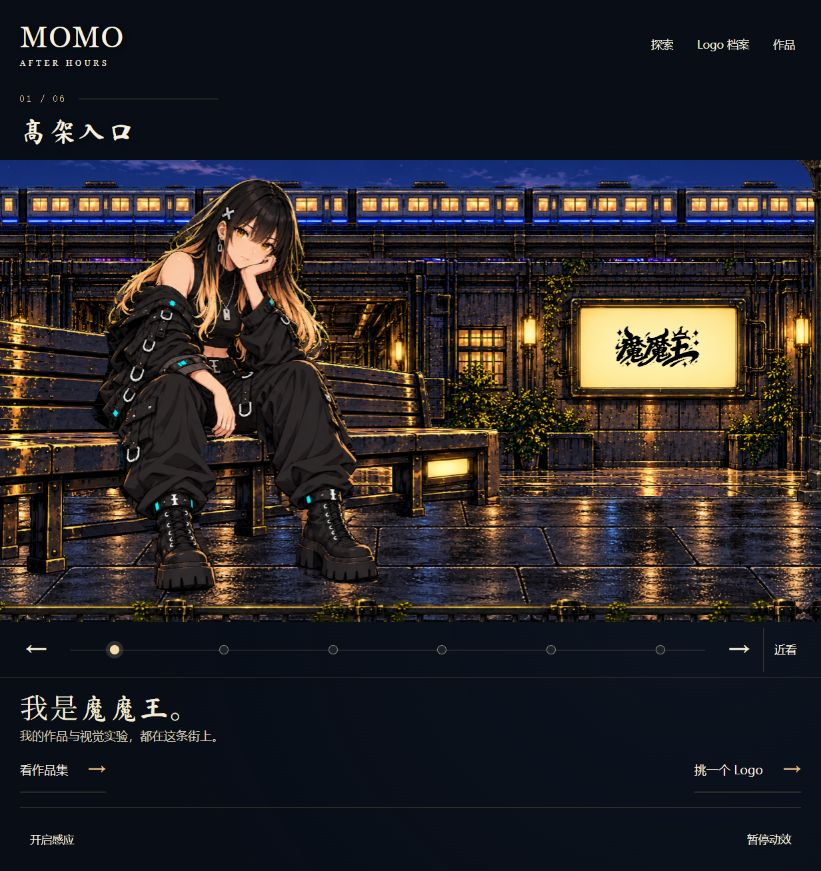

# 魔魔王 · 午夜街区

## [↗ 进入魔魔王网站](https://momowangouo.github.io/momowang-city/)

**连续插画城市 · 分层视差 · Logo 档案**

[沿街探索](https://momowangouo.github.io/momowang-city/#street) · [玻璃廊](https://momowangouo.github.io/momowang-city/#glass) · [放映区](https://momowangouo.github.io/momowang-city/#cinema)

这是魔魔王的个人作品站。六个站点与五段连接街道连成一幅城市全景大图，镜头沿街移动，在预设观赏位置停靠；前景、人物与建筑通过分层视差展开距离。

各站角色保留独立姿势，以眼神、衣料和发片回应观察，高架列车循环穿过街区。Logo 终端提供原稿、呈现方案查看与下载；放映区预留三个作品位置，等待后续内容更新。

本仓库保存公开静态网站及已获授权的素材，由 GitHub Pages 发布。开发源码和制作源图保存在私人仓库，签名母版审批状态独立于网站展示。

真实移动设备验收仍待完成。
